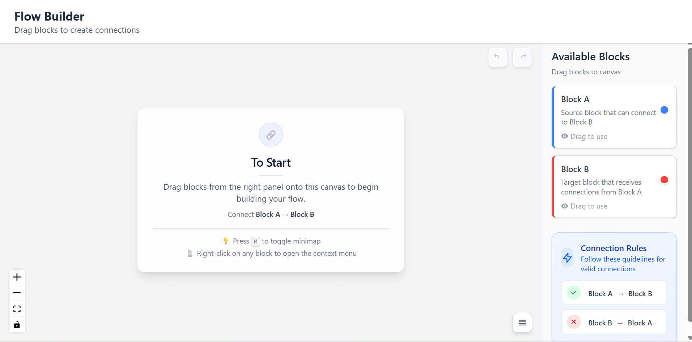

## Block Interaction Canvas

Interactive canvas built with React Flow and Vite. Drag predefined blocks onto the canvas and connect them according to configured rules. Includes Undo/Redo, context menus, minimap toggle, and keyboard shortcuts.

### Features
- **Drag & drop blocks** from the right panel onto the canvas
- **Connection rules**: Only Block A (source) → Block B (target)
- **Undo/Redo**: Buttons and shortcuts (Ctrl/Cmd+Z, Ctrl/Cmd+Y / Ctrl+Shift+Z)
- **Context menu** on right-click of a block
- **Minimap** toggled with M key



## Getting Started

### Installation
```bash
npm install
```

### Run the app (development)
```bash
npm run dev
```
Then open the URL shown in the terminal (typically `http://localhost:5173`).

## How to Use
- Drag a block from the right panel to the canvas.
- Connect from a Block A handle to a Block B handle.
- Hold and move the mouse to move over the canvas 
- use mouse to increase and decrease the size of snapshot you made.
- **Undo** recent actions with Ctrl/Cmd+Z or the top-right Undo button.
- **Redo** with Ctrl/Cmd+Y or Ctrl/Cmd+Shift+Z or the top-right Redo button.
- Toggle minimap with the M key.
- Right-click a block to open its context menu.

## Summary of the Solution
- Summary of the Solution
-Drag-and-drop interface with predefined blocks using React Flow.
-Connections restricted: Only Block A → Block B is valid.
-Undo/Redo support for connection through snapshot-based history stacks.
-Context menu on right-click displaying “Hello World”.
-Keyboard shortcuts and minimap toggle for improved UX.

## Design Decisions
- **Snapshot-based history**: Captures { nodes, edges } as JSON for simplicity and reliability.
- **Refs for stacks**: useRef avoids unnecessary rerenders when stack sizes change.
- **Guarding updates**: isApplyingHistory flag ensures applying history doesn’t create new entries.
- **Non-invasive integration**: History logic wraps around React Flow’s state hooks.
- **Keyboard-first UX**: Common, familiar shortcuts and button affordances.

## Deployment
### Deployed Vercel Link

[](https://flow-builder-sigma.vercel.app/)

### Live Demo
- Deployed URL: `https://flow-builder-sigma.vercel.app/`

## Project Structure(In case you want to download and make any changes)
```
src/
  components/
    Canvas.jsx           # Canvas state, history, keyboard shortcuts
    CanvasControls.jsx   # React Flow controls, minimap toggle, Undo/Redo buttons
    CustomBlockNode.jsx  # Node UI and handles
    BlockPanel.jsx       # Right panel with draggable blocks and rules
    ContextMenu*.jsx     # Context menu and items
  data/blocks.json       # Block definitions
  utils/constants.js     # React Flow config, edge/handle styles, connection rules
```

### Made with ❤️ using React Flow and Vite.  
